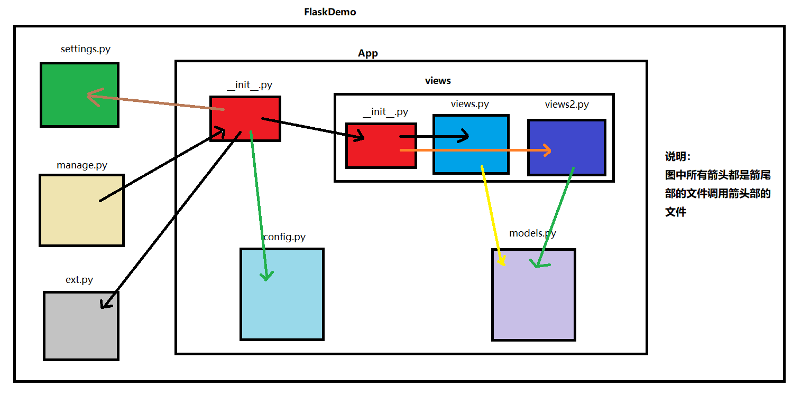

# Flask脚手架

这个项目是一个功能拆分的脚手架Demo，是根据千峰教育的Flask视频教程编写的，代码中仅实现了个个部分的的示例代码，使用者可以根据示例代码编写自己的业务。

Demo中进行了详细的注释，以方便使用者快速了解当前代码的使用方法和代码逻辑结构。

<br/> 
项目结构：    
<br/> <br/> 

│  ext.py  
│  manage.py  
│  settings.py  
│  
├─App  
│  │  config.py  
│  │  models.py  
│  │  sqlite.db  
│  │  __init__.py  
│  │  
│  ├─static  
│  ├─templates  
│  ├─views  
│  │  │  views.py  
│  │  │  views2.py  
│  │  └─  __init__.py    
   
 <br/> <br/>    
     
  
FlaskDemo关系图：



环境要求：
python 3.6  
mysql 5.5  

安装环境  
Windows下：     
        1.启动cmd窗口  
        2.将目录切换到FlaskDemo下  

使用conda进行安装

conda安装命令：
```angular2html
conda install --yes --file conda-requirements.txt
```

使用pip进行安装
```angular2html
pip install -r pip-requirements.txt
```

如果使用conda安装时有的模块安装失败，就用pip进行安装  
（如果conda使用的是清华源，可能Flask相关的模块会找不到）


项目初始化

1.修改配置文件  
在FlaskDemo/App/config.py中修改对应开发环境的数据库配置  
在FlaskDemo/settings.py中配置你需要的启动模式，RUN_MODE会去匹配config.py中对应的配置

2.在mysql中创建数据库：
```angular2html
create database 你的数据库名 charset=utf8
```

3.生成数据表
```angular2html
python manage.py db init
python manage.py db migrate
python manage.py db upgrade
```

4.启动项目  
第一次启动如果很卡，可以刷新几次浏览器，或者使用多线程启动

```angular2html
# 单线程启动
# 默认在本机IP的5000端口启动
python manage.py runserver

# 多线程启动
python manage.py runserver --threaded
```

5.运行结果  
如果在浏览器中输入前面你设置的ip：port，浏览器显示 Hello world!  表示运行成功。


最后  

源码中有十分详细的注释，在FlaskDemo/note.txt中还有对整个项目需要注意的地方以及个人感觉比较重要的笔记和使用方法  


这份代码本身也不属于我个人的劳动成果，我只是手码了一遍，整理了一下并加了一些注释和自己的理解，所以不存在什么版权问题，如果说版权那应该属于千峰教育所有。


如果您感觉有用，请帮我点个star，谢谢。


另外，可以访问我的个人博客，主要记录我在机器学习方面遇到的问题以及个人总结。  
博客地址：www.mlzhilu.com


希望能帮助更多的同行省去繁琐的工作。

